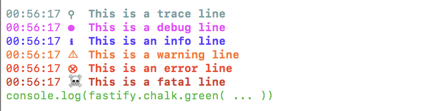

# fastify-chalk
 
A colorful terminal logger using [chalk](https://github.com/chalk/chalk) for [Fastify](fastify.io).

## Features

* Displays time
* Colorful outputs and shorthands
* Logging levels: all, trace, debug, info, warn, error, fatal

## Install

```bash
npm install fastify-chalk
```

## Usage

```
const fastify = require('fastify')();
fastify.register(require('fastify-chalk'))
// or provide options object
// fastify.register(require('fastify-chalk'), {disabled:false});


fastify.listen(8080, (err) => {
  // use the following shortands
  fastify.trace('This is a trace line');
  fastify.debug('This is a debug line');
  fastify.info('This is an info line');
  fastify.warn('This is a warning line');
  fastify.error('This is an error line');
  fastify.fatal('This is a fatal line');
  
  // or use chalk directly
  console.log(fastify.chalk.green('console.log(fastify.chalk.green( ... ))'));
});
```

### This will output



## API

You get the following functions

* fastify.trace()
* fastify.debug()
* fastify.info()
* fastify.warn()
* fastify.error()
* fastify.fatal()

You can override the following default options

```
var options = {
  time: true,
  timeFormat: 'HH:mm:ss', //moment.js time format
  level:'all', //all, trace, debug, info, warn, error, fatal
  trace: '#455a64',
  debug:'#d500f9',
  info: '#0000ff',
  warn:'#ff4400',
  error:'#d50000', //change color of error line
  fatal:'#aa0000',
  disabled:false, //true to disable logging
  symbols: 
    {
      trace: '\u26b2',
      debug: '\u2689',
      info: '\u2139',
      warn: '\u26A0',
      error: '\u2a02', //you can override error symbol, eg: 'ERR'
      fatal: '\u2620'
    }
}; 

fastify.register(require('fastify-chalk'), options);
```
